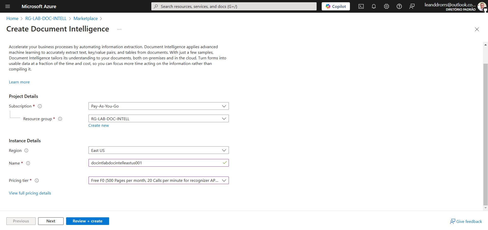

# Azure AI Document Intelligence - Identificador e Extrator de Dados de Cartão de Crédito

Este projeto faz parte do **Bootcamp Microsoft Certification Challenge #1 - AI 102**. O objetivo é desenvolver um _Identificador e Extrator de Dados de Cartão de Crédito_, usando os Serviços de Armazenamento e IA do Azure. Uma aplicaçao com o Azure SDK para Python será criada com uma interface para upload de um documento do tipo imagem. Ao fazer upload da imagem para o serviço **Azure Storage Accounts**, o serviço **Azure AI Document Intelligence** validará se a imagem é um cartão de crédito e extrairá dados como _Nome do Titular_, _Banco Emissor_ e _Data de Validade_. Na configuração das instâncias e recursos, as chaves e endpoints das APIs são guardadas para utilização na aplicação Python.

- **Azure Storage Accounts** - Use Blobs, Tables, Queues, Files, and
Data Lake Gen 2 para armazenamento em nuvem confiável e econômico.

- **Azure AI Document Intelligence** - Serviço AI do Azure que permite que você crie soluções inteligentes de processamento de documentos. Anteriormente conhecido como Azure Form Recognizer.

## 1. Configurando as Instâncias e Recursos

### 1.1 Criar um Grupo de Recursos 

No portal do Azure, crie um grupo de recursos para organizar os recursos do projeto: o Azure Storage Accounts e o Azure AI Document Intelligence.

Escolha um nome e a região East US para o resource group.

### 1.2 Provisionar o Serviço Storage Account

Dentro do resource group, crie uma instância do serviço Storage Account.

Escolha um nome para a instância, selecione a região East US, o serviço Azure Files, performance Standard e opte pela redundância local (LRS). Clique em Review + create.

Storage account criado com sucesso.

Agora vamos pegar a Key e o nome do Storage Account. Clique no menu à esquerda em Security + Networking e depois em Access Keys. Na página, copie o Storage account name e a Key do serviço.

- STORAGE_NAME = strlabdocintelleastus001
- STORAGE_CONNECTION_STRING="DefaultEndpointsProtocol=https;Acco...

### 1.3 Provisionar o Serviço Document Intelligence (form recognizer)

Ainda no resource group, crie uma instância do serviço Document Intelligence (form recognizer).

Escolha um nome para a instância, selecione a região East US e o Pricing Tier Free F0. Clique em Review + create.

Ao finalizar o deployment, clique em Go to resource. Na nova página, lado superior direito, é possível ver:

- Endpoint: https://docintlabdocintelleastus001.cognitiveservices.azure.com/
- Manage keys: Click here to manage keys (clique aqui para pegar a KEY (Chave) e ENDPOINT para consumo da API)

- DOCINTELL_KEY1 = G9GhOtx6Z3s2dYkmjW7hgvwoBZPMesieq6MvMBDY4PBcGQyJ87NLJQQJ99BAACY....
- DOCINTELL_ENDPOINT = https://docintlabdocintelleastus001.cognitiveservices.azure.com/

### 1.4 Criar um Container no Storage Account Criado

Acesse o grupo de recursos criado e clique no Storage Account criado.

Na nova página, no menu à esquerda, clique em Storage browser. Em seguida selecione Blob containers e depois Add container.

Em New Containers, dê o nome de _cartoes_ e clique em create.

STORAGE_CONTAINER_NAME = cartoes

Após, no menu à esquerda, clique em Settings e selecione Configuration. Na página, na primeira configuração, _Allow Blob anonymous access_, marque Enabled e depois aperte o botão Save para finalizar a configuração do Container cartoes.

Agora, acesse o container criado cartoes e no meu superior clique em Change access level e selecione Blob (anonymous read access for blobs only).

Tudo pronto para criarmos a aplicação.

## 2. Criando a Aplicação

